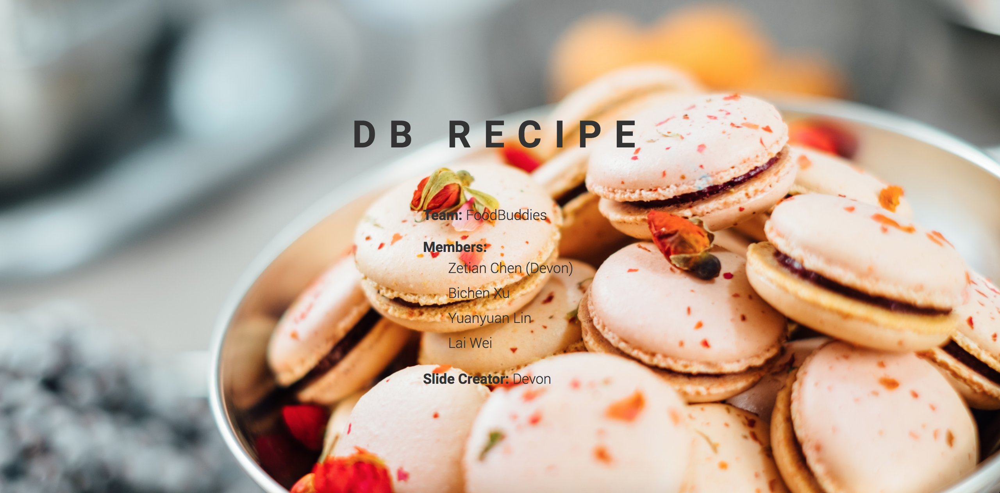

# DB Recipe Webslide

**author**: Zetian Chen

## Cover

## Description

This is a webslide I created when I took INFO 340 during the summer quarter. The instructor of this class was Greg Thomas Hay, professor of iSchool.

We were required to target at a social group who confront some sort of problem and build a database to solve that problem. As a result, our group targeted at people who want to cook by themselves but do not know how to cook. The database we designed is called db_recipe. It stores the all the details of recipes including recipe type, procedures, equipments, duration, difficulty level, etc.

In order to make a presentation in front of the whole class and explain the target, the purpose and design of our database, I created this webslide (and I was the team leader). This webslide explains which social group we target at, what problems they are facing, how our dababase is designed and structured, and why it enables that group of people of solving the problems, as well as some SQL code to demonstrate the implementation (queries, stored procedures, business rules, etc.).

Also, this github repo contains the vsd file for our database. Our database is currently running in server **IS-HAY04.ischool.uw.edu.**

## Link to the hosted website

[Click Me!](https://neuricos.github.io/food_buddies/)